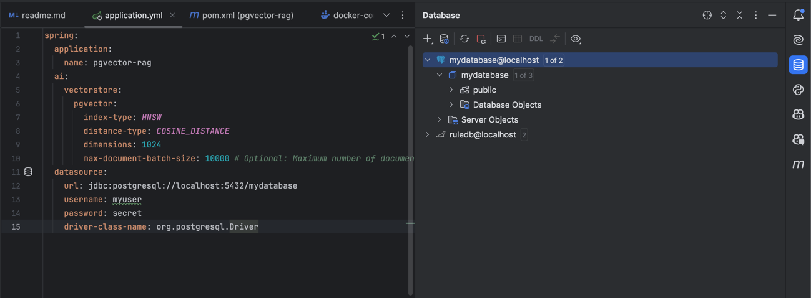
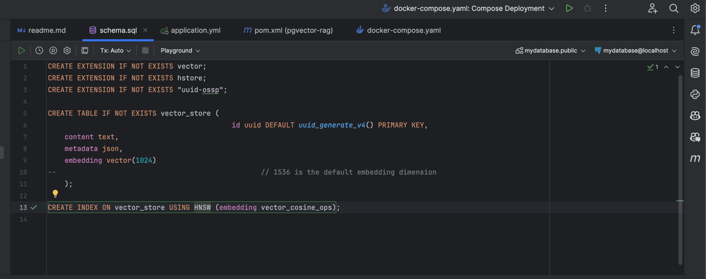

# RAG using  Spring AI + Postgres Vector DB

## Pre-requisite

- Docker installed
- Ollama installed

## SETUP

### Postgres DB

```shell
mkdir ~/postgres-volume
```

- Using docker-compose to run Postgres DB
```shell
docker compose -f docker-compose.yaml up
```


- add vector extension and create vector-store table



## How to use

```http request
### without advisors, no memory
###
GET http://localhost:8080/api/v1/rag/ask?question=how many states are in india

###
GET http://localhost:8080/api/v1/rag/ask?question=Winter is blue

###
GET http://localhost:8080/api/v1/rag/ask?question=what is blue

### with default Q&A advisor and memory advisor
###
GET http://localhost:8080/api/v1/rag/ask/memory?question=I am bob, say hello to me

###
GET http://localhost:8080/api/v1/rag/ask/memory?question=who am I and what i want to do?

### with Q&A advisor and default memory advisor
###
GET http://localhost:8080/api/v1/rag/ask/qaadvisor?question=I am tom, how to become a judge in India
###
GET http://localhost:8080/api/v1/rag/ask/qaadvisor?question=what is my name and what I want t o be

### with RAG advisor and default memory advisor
###
GET http://localhost:8080/api/v1/rag/ask/ragadvisor?question=how to impeach a judge

###
GET http://localhost:8080/api/v1/rag/ask/ragadvisor?question=define 'misbehaviour' and 'incapacity'

###
GET http://localhost:8080/api/v1/rag/ask/ragadvisor?question=what amounts to misconduct or breach of the judicial conduct code

```


## References

- https://github.com/YugabyteDB-Samples/openai-pgvector-lodging-service
- https://www.youtube.com/watch?v=ctsGQ3lhcYA
- https://www.youtube.com/watch?v=rzLKDppAsA4
- 
